# Submodel Creator Guide

Status: Draft
Type: Documentation

## Overview
- **Purpose:** Explain how to create a Submodel (e.g., DPP – Digital Product Passport) for a Catalog Part using the Submodel Creator.
- **Audience:** Frontend users/operators configuring submodels based on a schema.
- **Outcome:** A validated JSON is created and published as a submodel for the selected Catalog Part.

## Prerequisites
- **Registered Part:** The Catalog Part must already have at least one registered submodel for the “+ New Submodel” button to appear.
- **Selected Schema:** Know which schema you want to use (e.g., DPP). The creator interprets the schema to build a dynamic form.

## Start a New Submodel
1. Navigate to the Catalog Part details page.
2. Click `+ New Submodel` to launch the creator workflow.

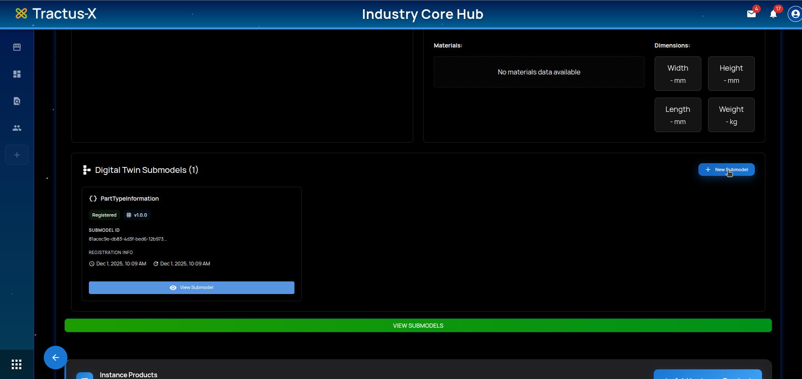

## Choose Target Schema
- Select the card for the desired Submodel Schema (e.g., DPP). The card shows a short description and the namespace.

## Submodel Creator Layout
When the creator opens, you'll see:

- **Header & Context:** Shows target product and contextual metadata. Some items are interactive.
- **Floating Status Bar:** Displays JSON status, a `Validate` action, and reveals `Create Submodel` once JSON is valid.
- **Left Panel – Submodel Configuration:** Dynamic form generated from the selected schema. You can filter required fields, import existing JSON, and clear the form.
- **Right Panel – JSON & Rules:** Live JSON preview, validation errors list, and Schema Rules explorer.

### Left Panel: Submodel Configuration
- **Only Required filter:** Toggle to show just required fields to speed up data entry.

	
	

- **Import JSON:** Paste raw JSON or load from a file to prefill the form.

	
	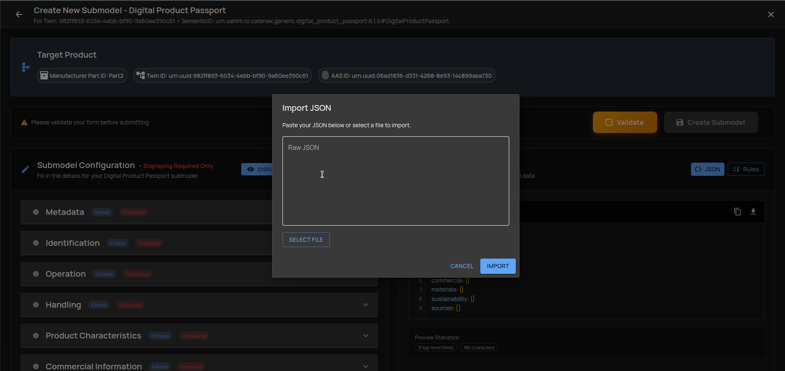
	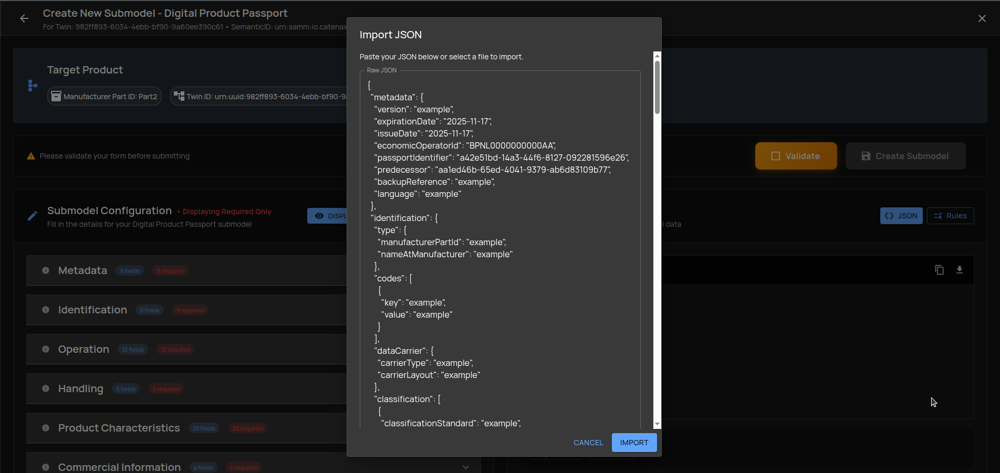

- **Clear Form:** Reset all form inputs.

	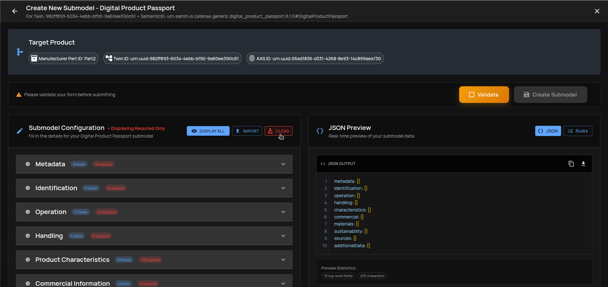
	

### Right Panel: JSON Preview, Errors, and Rules
- **Tooltips & Field Info:** Hover the info icon to see field description and URN. Clicking it navigates to the related Schema Rules.

	
	

- **Interactive JSON Preview:** Click entries in the JSON preview to jump to the corresponding form field.

	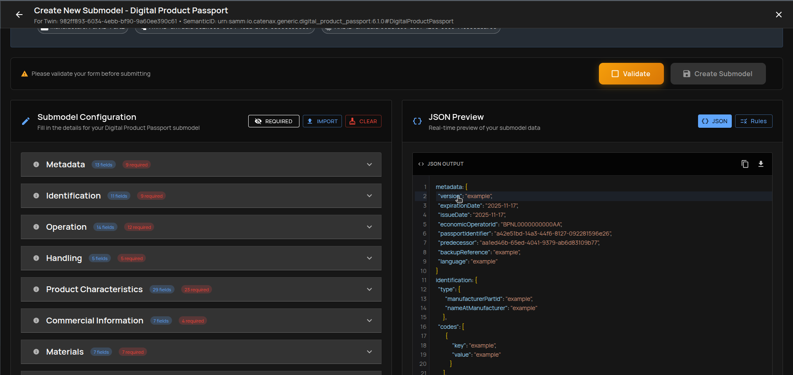
	

## Fill the JSON
You can define the submodel content using the dynamic form. The form is built from the schema (e.g., DPP) and organizes sections and fields.

Tip: Enable **Only Required** to speed up initial completion.

### Option 1: Fill Manually
Supported field types and helpers:

- **Standard values:**

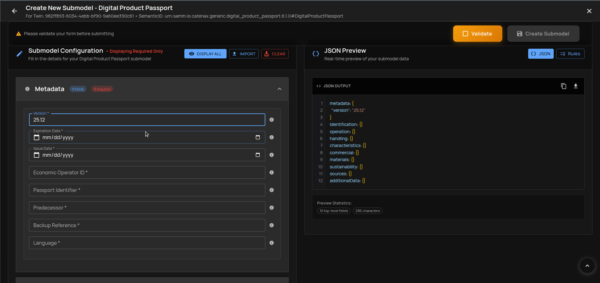

- **Date values:**

- **Predefined values:**

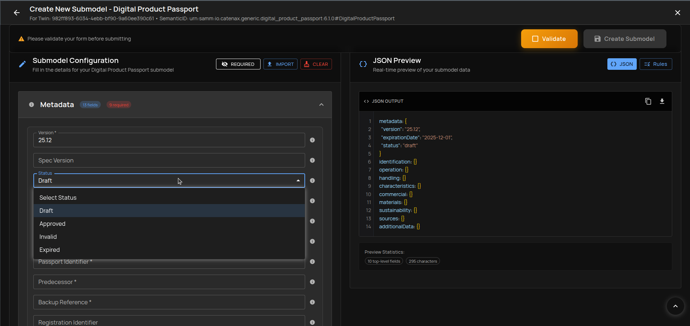

- **Boolean values:**

- **Numeric values:**

- **Arrays:**

- **Nested structures:**

### Option 2: Import Existing JSON
Prefill the form by importing an existing JSON (paste or file). This is the fastest route if you have a valid payload.

	
	
	

## Validate the JSON
Click `Validate` in the floating status bar to check the payload against schema rules.

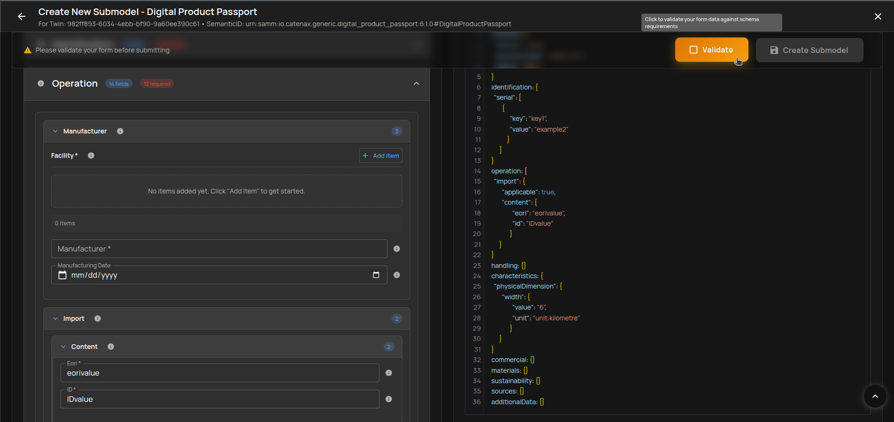

Two possible outcomes:

### Case A: JSON Has Errors
The right panel shows grouped validation errors.

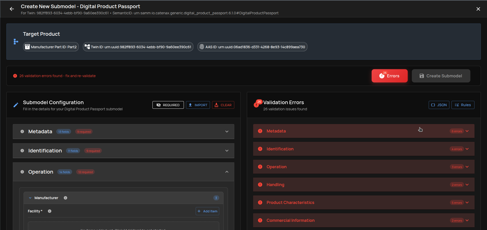

- **Return to JSON:** Click the `JSON` tab or change any form value.

- **Expand an error group:** Click a group to see individual issues.

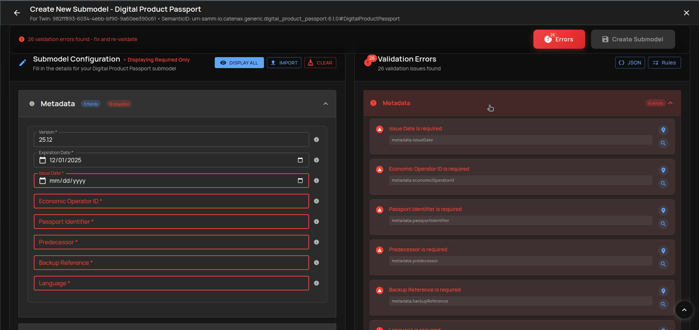

- **Go to field:** Jumps to the related form control.

	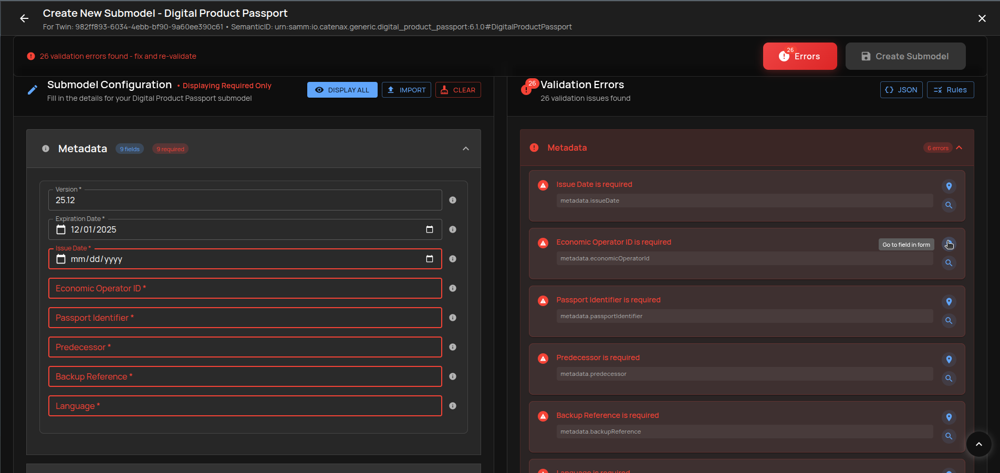
	

- **Search in Schema Rules:** Opens Schema Rules for the field and highlights applicable constraints.

	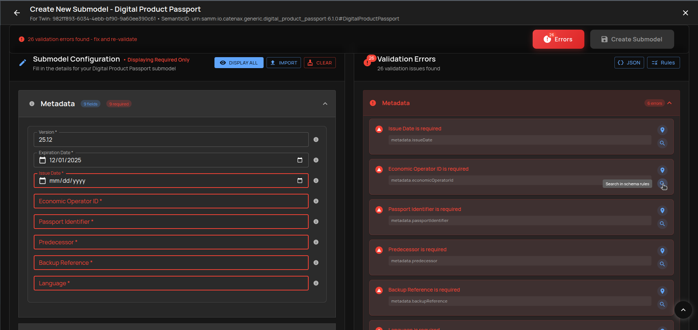
	

- **Go to field from Rules:** From a rule, jump back to the field to fix it.

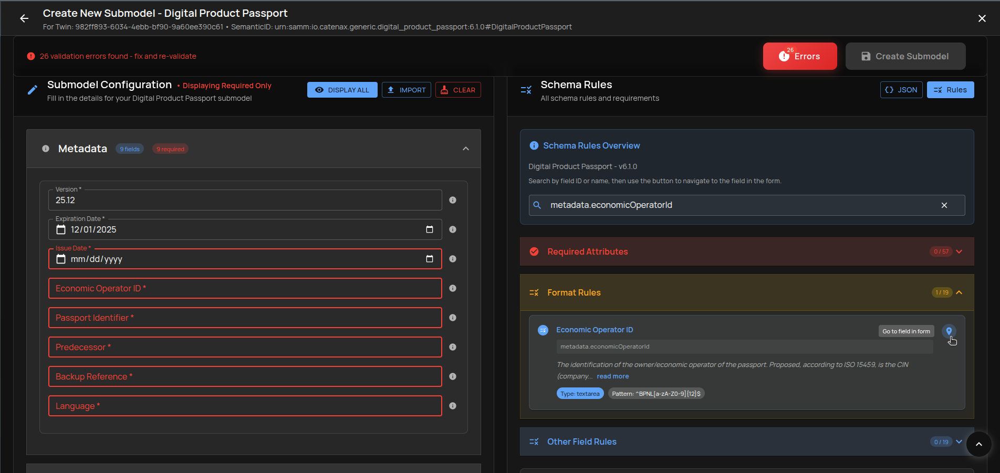

Work through the listed errors until validation passes.

### Case B: JSON Validated
When the JSON is valid, you'll see a confirmation state.

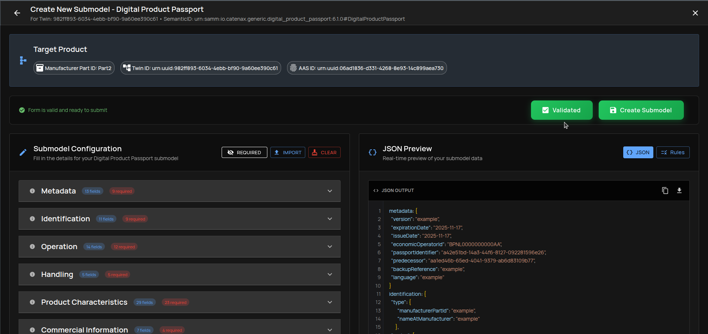

The `Create Submodel` button becomes enabled.

## Create the Submodel
1. Click `Create Submodel`.
2. Wait for the creation to complete. A success notice confirms the submodel was created.

	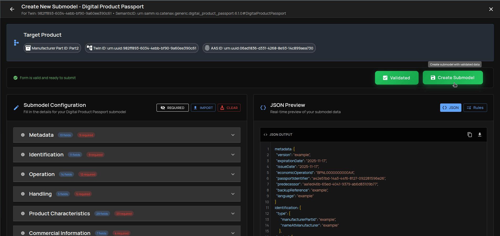
	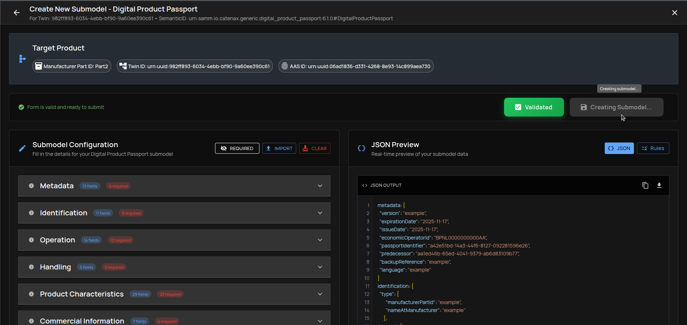

## Verify in Catalog Part
Open the Catalog Part view and confirm the new DPP submodel appears.

## Tips & Troubleshooting
- **Validation fails repeatedly:** Use `Only Required` filter, then incrementally add optional fields; check Schema Rules for each failing field.
- **Import issues:** Ensure JSON is valid per schema; try paste mode to see immediate parsing feedback.
- **Navigation aids:** Use JSON Preview and field tooltips to understand structure and constraints quickly.
- **Clearing form:** Use `Clear Form` to restart if the structure goes off-track.